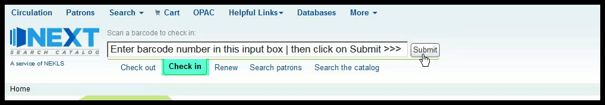
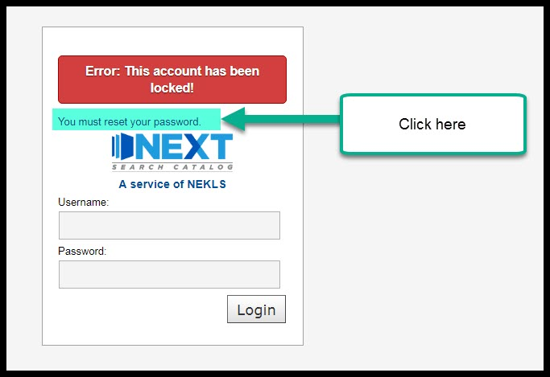
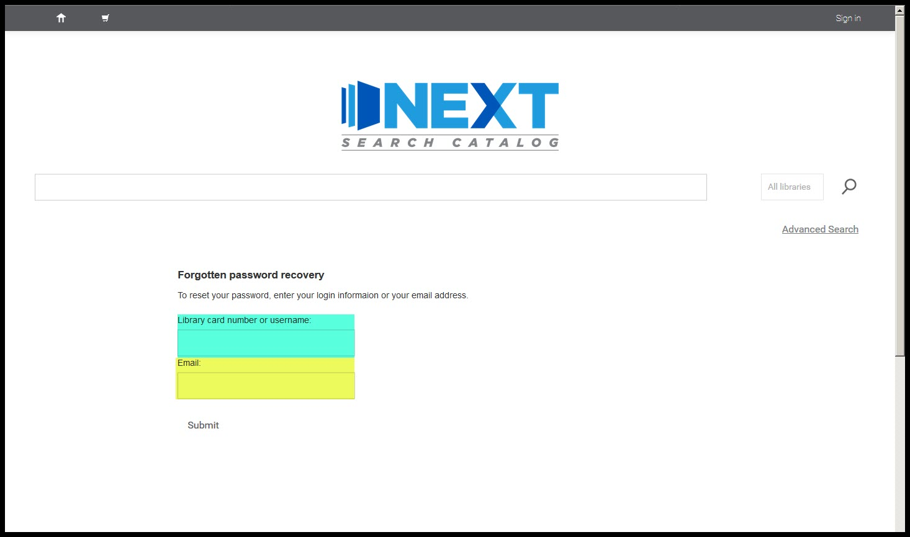
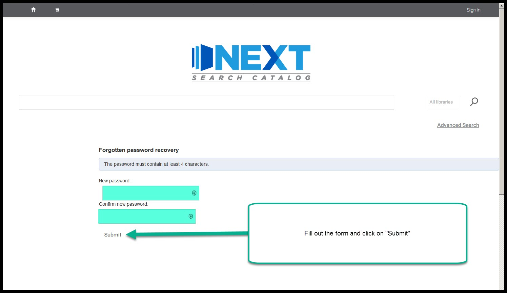
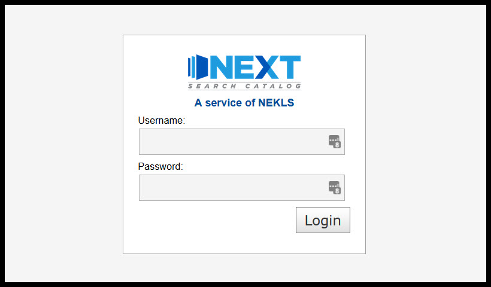

Notes/appendix for basic staff training
=======================================

.. _checkinaccess:

Three ways to access check-in
-----------------------------

A. Access check-in from the flexible input box
^^^^^^^^^^^^^^^^^^^^^^^^^^^^^^^^^^^^^^^^^^^^^^

From most pages you can set the flexible input box to Check in and then start entering barcode numbers in the input box.

.. raw:: latex

    \newpage

B. Access check-in from the home page
^^^^^^^^^^^^^^^^^^^^^^^^^^^^^^^^^^^^^

From the home page you can click on the "Circulation" button and then click on the "Check in" button on the circulation page.

  .. image:: ../images/100.jpg

  .. raw:: latex

      \newpage

C. Access check in from any page
^^^^^^^^^^^^^^^^^^^^^^^^^^^^^^^^

From any page you can click on the "Circulation" link in the page header and then click on the "Check in" button on the circulation page.

  .. image:: ../images/110.jpg

.. _stafflocked:

Staff account locked due to unsuccessful login attempts
-------------------------------------------------------

If you attempt to log into the staff client more than five (5) times with an incorrect password, the account you're using will be locked.  This is a security measure to prevent unauthorized persons from accessing the confidential information on our system.

.. image:: ../images/450.jpg

If this happens, you have two (2) options for unlocking the account:

Unlock by calling NEKLS
^^^^^^^^^^^^^^^^^^^^^^^

Because staff login accounts have a "SYSTEM LOGIN ONLY" account category, only system administrators can change the passwords on these accounts through the staff client.  Since the only system administrators are at the NEKLS office, if you lock yourself out, NEKLS staff should be able to give you a new password to unlock the account.

Unlock through the OPAC
^^^^^^^^^^^^^^^^^^^^^^

If you lock a staff account *and* there is an e-mail address on the account, you can unlock the account yourself by clicking on the "You must reset your password" text on the login page.

Note: most staff accounts such as LIBRARYCIRC; LIBRARYTECH; and LIBRARYDIRECTOR have the default e-mail address for that library on the account as their e-mail address.  If you do not normally have access to this account or are unsure which email account goes with your account, this method will not really work for you.

1. On the staff client login page, click on the "You must reset your password" link.

2. On the "Forgot your password?" page, you need to fill out the form with A) your staff username; and B) the e-mail address that goes with this account.

3. If the login information and the e-mail address match this message should appear:

.. image:: ../images/410.jpg

4. If successful, you should receive an e-mail address like this one within 15 minutes:

.. image:: ../images/420.jpg

5. When you open the link included in the e-mail, you should be taken to a page that will allow you to create a new password:

6. A final message should indicate if the password has been successfully changed.

.. image:: ../images/440.jpg

7. Go back to the login page and try to log in again with the new password.

.. _deletedtimeline:

Timeline for deleted items
--------------------------

A. Patron checks out an item and a due date is assigned to the item (the due date may be updated if the patron renews the item)
B. X days after an item's due date, the patron is sent a first overdue notice
  - the number of days varies by library
C. 35 days after an item's due date, the patron is sent a second overdue notice saying that the item will be declared "Lost" in 10 more days
D. 45 days after an item's due date, the patron is sent a third overdue notice saying that they are being billed for the replacement cost of the item
E. 46 days after an item's due date at between 12:01 a.m. and 2:00 a.m., the item's status is changed from "checked out" to "Lost (more than 45 days overdue)"
  - when the status is changed to "Lost (more than 45 days overdue)" the item is removed from the list of items checked out to the patron and the patron is billed for the replacement cost of the item as recorded in the item record (Marc field 952$v)
F. 13 months after the item has been declared "Lost (more than 45 days overdue) the system will automatically delete the item record
  - At this time, a copy of the item's record is moved from the "items" table in the database to the "deleteditems" table
  - ** some libraries have policies and processes in place to manually delete these items before the 13 month automatic deletion has been triggered
G. 13 months after the item data has been moved from "items" to "deleteditems" the system will automatically delete the data from the "deleteditms" table - this is done to reduce the size of the database

Frequently asked questions about deleted items
^^^^^^^^^^^^^^^^^^^^^^^^^^^^^^^^^^^^^^^^^^^^^^

Q: "A patron returned an item that has been deleted.  How can I find out more information about this deleted item?"

A: If the item was deleted less than 13 months ago - whether it was deleted automatically or manually - you can run report 3113 to find out more information about the item.  This report shows the following information about a deleted item:

- Date and time of deletion
- Item home branch
- Item current branch
- Shelving location
- Item type
- Collection code
- Call#
- Title
- Item barcode
- Item ID number
- Damaged status at time of deletion
- Lost status at time of deletion
- Withdrawn status at time of deletion
- Link to the bibliogrpahic record -- unless the bibliographic record has also been deleted
- Link to report 3009 (clicking on this link searches for the item barcode number in every patron's fine records)

Q: "Someone returned an item that has been deleted.  How do I find out if someone paid for the item?"

A: You can run report 3009 and search the fines/fees table for the entire system for any item barcode number that has been recorded in the "Description" field of the fines record - whether the item that goes with that barcode number has been deleted or not.  This means that, if a patron has been automatically billed, this report will show that patron's barcode number.  However, this report will also show you any other automatically generated fees plus any automatically created credits that include that item barcode number.  This report will not show you any manually created invoices or manually created credits - unless the staff member that created the invoice or credit added the barcode number of the item to the manually created invoice or credit.
