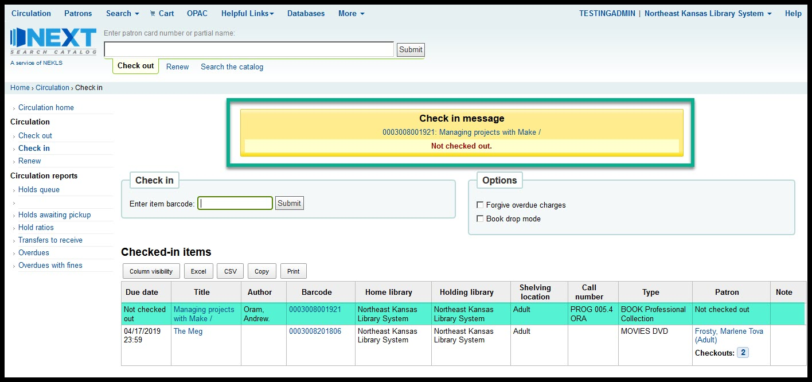
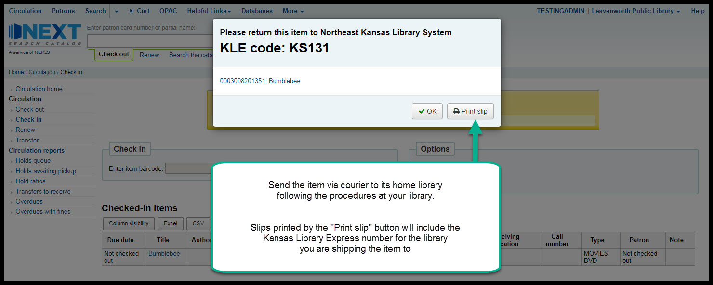
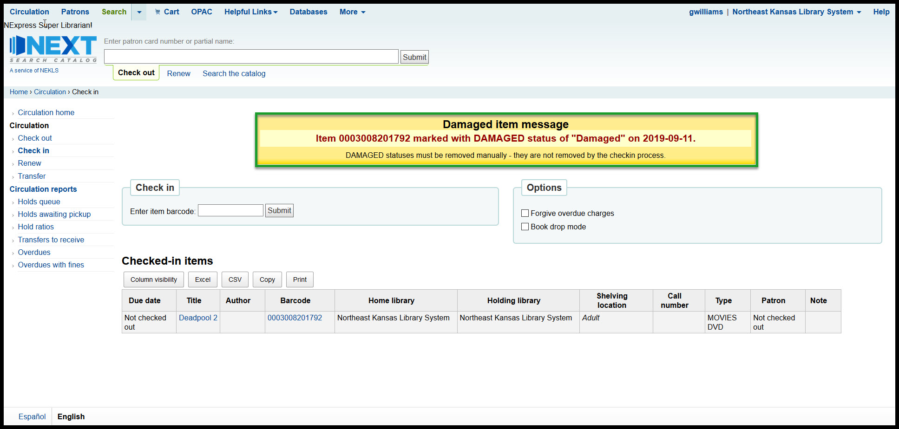

####################
Basic staff training
####################

.. comment [TODO] what is Next Search Catalog

*******
History
*******

.. include:: ..\pages\history.rst

.. raw:: latex

    \newpage

How to log in
-------------

Go to the staff client home page and enter your username and password

.. image:: ../images/010.jpg

Note:

If you see a "You must reset your password" message, please see the instructions at (":ref:`stafflocked`") to learn how to unlock the account.

.. raw:: latex

    \newpage

Next staff client home page
---------------------------

If you log in successfully, you should see the staff client's home page - which should look something like this:

.. image:: ../images/020.jpg

.. raw:: latex

    \newpage

Things to note:

1. In upper right hand corner of every page you'll see the username you've used to log in and the library that you are logged in at
2. Which modules you see will depend on your security level - the TESTINGADMIN account we've used to log in to create these screenshots has the highest security level possible
3. Important links and information will appear on the left hand side of the home page
4. Statistics and other important information will appear in the area at the bottom of this page

.. image:: ../images/030.jpg

.. raw:: latex

    \newpage

Useful things to know
---------------------

Page header
^^^^^^^^^^^^^^^^^^^^^^^^^^^^^^^^^^^^^^^^

The same header appears on every page in the staff client and allows you to easily find your way to any module you have access to on the left hand side of the page.  You can always see your username and logged in library on the right hand side of the page.

.. image:: ../images/080.jpg

Next logo
^^^^^^^^^^^^^^^^^^^^^^^^^^^^^^^^^^^^^^^^

The Next Search Catalog logo appears on most pages in the staff client.  Clicking on the logo takes you back to the staff client home page.

.. image:: ../images/070.jpg

Flexible search box
^^^^^^^^^^^^^^^^^^^^^^^^^^^^^^^^^^^^^^^^
A flexible input box appears on most pages just to the right of the logo:

.. image:: ../images/040.jpg

On the home page, you can switch from Check out to Check in to Renew to Search Patron to Search the catalog all by clicking on the text under the input box.

The flexible input box appears on *almost* every page in the staff client and allows you to quickly switch functions.  The functions that are available vary from page to page in the staff client.

.. raw:: latex

    \newpage

Breadcrumbs
^^^^^^^^^^^^^^^^^^^^^^^^^^^^^^^^^^^^^^^^

Breadcrumbs appear on every page in the staff client.  This allows you to easily see which module and what function of that module you are using.

.. image:: ../images/050.jpg

Each level to the left of a '>' symbol is one level up in the system's hierarchy.

Language controls
^^^^^^^^^^^^^^^^^^^^^^^^^^^^^^^^^^^^^^^^

The bottom left hand corner of each page in the staff client includes controls to switch the catalog's built-in language from English to Spanish.

  .. image:: ../images/060.jpg

These controls only affect the language of the built-in controls in the system.  It will not change the language of any data we've added to the system such as patron names or bibliographic record information.

.. raw:: latex

    \newpage

Checking items in
-----------------

Check-in is your friend
^^^^^^^^^^^^^^^^^^^^^^^

*Check-in is your friend*

If you find an item and you're not sure what to do with it, check in the item and the system will tell you what to do with the item.

*Check in is your friend*

If an item has been marked as "Lost" or "Missing," checking in the item will remove these statuses.

*Check in is your friend*

If an item needs to be shipped to another library, checking in the item will trigger the transfer process.  If an item is "In transit" back to your library, checking the item in will take the item out of transit and make it appear as "Available" in the catalog again.

*Check in is your friend*

Checking an item in updates an item's "Last seen" date, so checking an item in can help staff locate items by letting staff know when and where an item was last checked in.  The check-in process does not damage an item or the integrity of an item's bibliographic record.

*Check in is your friend*

So, if you're not sure what to do with an item, check it in and let the system tell you if the item needs any special handling or if it should just be reshelved.

How to check-in
^^^^^^^^^^^^^^^

A. Go to the check-in page (see  ":ref:`checkinaccess`" to learn how to get there)
B. Scan an item barcode in the check-in input box

.. image:: ../images/120.jpg

.. raw:: latex

    \newpage

Normal check-in results
^^^^^^^^^^^^^^^^^^^^^^^

- If the item being checked in was checked out to a patron at the time it was checked in, the *Patron* column on the check-in table will display the patron's name.  This column will also indicate how many items that patron still has checked out.

- If the item being checked in was not checked out to a patron at the time it was checked in, you will see a yellow pop-up message on the screen that says "Not checked out" and the *Patron* column  on the check-in table will say "Not checked out"

.. raw:: latex

    \newpage

Checking in an item on hold
^^^^^^^^^^^^^^^^^^^^^^^^^^^

If you check in an item that has has arrived at your library to fill a patron's request, checking in the item will generate a pop-up message indicating that the item needs to be held for that patron, and the patron's contact information.

- When this happens you need to follow the procedures at your library for filling holds which may include printing a hold slip receipt for the item.

.. raw:: latex

    \newpage

Checking in an item to be shipped
^^^^^^^^^^^^^^^^^^^^^^^^^^^^^^^^^

After you enter the barcode number, if the item needs to be shipped to another library, a transfer window will pop up.  There are two types of transfer:

1. Transfering an item with a request for pickup at a different library

2. Transfering an item that is owned by another library back to its home

In either case you need to follow the procedures at your library for shipping items between libraries.  If your library prints receipts, the courier code for the receiving library should match the courier code on the KLE label you use for shipping the item.

.. raw:: latex

    \newpage

Checking in an item that had been declared lost or missing
^^^^^^^^^^^^^^^^^^^^^^^^^^^^^^^^^^^^^^^^^^^^^^^^^^^^^^^^^^

If a pop-up window appears indicating that the item was lost but has now been found, this indicates that the item had one of the following LOST statuses at the time it was checked in:

* (Lost)
* Lost (more than 45 days overdue) [automatically added]
* Lost (more than 45 days overdue) [manually added]
* Lost (Patron Claims Returned)
* Missing (inventory)
* Missing (unable to location on shelf)
* Tornado Damage

Checking the item in will remove any of these statuses from the item record and it should remove any fees to any patron that may have been billed for as lost item replacement fees.

.. image:: ../images/180.jpg

Checking in an item with a Damaged status
^^^^^^^^^^^^^^^^^^^^^^^^^^^^^^^^^^^^^^^^^

If a pop-up window appears indicating that the item has been marked with a DAMAGED status, checking the item in will not remove the damaged status.  The pop-up that appears merely indicates that the item has a DAMAGED status.  If you wish to remove the DAMAGED status, that must be done manually.

Checking in an item with a message
^^^^^^^^^^^^^^^^^^^^^^^^^^^^^^^^^^

If an item appears with a check-in message, you should follow your library's process for handling patron notes.  If the item is owned by another library, it's a very good idea to print out the note, put the note in the item, so the owning library can review the note when they receive the item.

.. raw:: latex

    \newpage

Checking in an item that cannot be found
^^^^^^^^^^^^^^^^^^^^^^^^^^^^^^^^^^^^^^^^

If you check in an item and get an "Item not found" message, it is possible the barcode scanner miss-read the barcode number or it's possible that item record has been deleted from the system.

If the item was deleted within the previous 13 months, you can find out basic information about the item by running report 3113.  If you wish to find any fines/fees history you can run report 3009.

.. raw:: latex

    \newpage

Checking items out
------------------

Access the patron’s account

.. image:: ../images/260.jpg

Make sure you’ve got the correct account

.. raw:: latex

    \newpage

Scan the item barcode in the “Enter item barcode”field

The "Checkouts table will update with information about the item you just checked out"

Follow your library’s procedures for errors if any error messages pop up

.. image:: ../images/300.jpg

.. raw:: latex

    \newpage

Print a receipt if needed once all items have been checked out

.. raw:: latex

    \newpage

.. Creating a new patron account
.. -----------------------------

.. raw:: latex

    \newpage

Searching the catalog
---------------------

The “Search the catalog” field in the flexible search box is a simple keyword search.

The advanced search page offers you more flexibility for searching.

.. image:: ../images/215.jpg

.. raw:: latex

    \newpage

The “Advanced search” page allows multiple search types

An advanced search can be limited by Collection code, Item type, and Shelving location

.. image:: ../images/230.jpg

An advanced search can also be limited by year and language (provided that the language information is included in the bibliographic record)

.. raw:: latex

    \newpage

Searches can also be limited by library and availability

.. image:: ../images/250.jpg

.. raw:: latex

    \newpage

.. Requesting an item
.. ------------------
