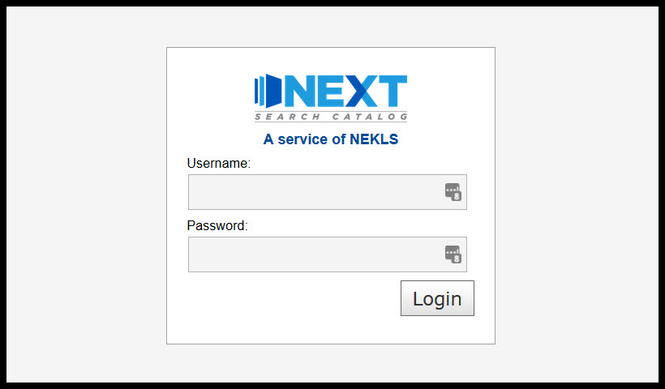

Staff training basics
=====================

###########################
Next Search Catalog history
###########################

Next Search Catalog began as a courier system among Northeast Kansas libraries, and several Northeast Kansas Library System members participated with the Kansas City Public Library Consortia (KCLC) through 2008.  In 2007, NEKLS began to explore alternative options to KCLC, and NEKLS decided in 2008 to manage its own shared catalog called "NExpress."  The Koha integrated library management system was chosen and NEKLS contracted with LibLime - a division of Progressive Technology Federal Systems, Inc. (PTFS).  The Next Koha system went live on August 15, 2008, with 13 participating libraries. In 2011, NEKLS changed support companies from LibLime to ByWater Solutions.  In August of 2018 the catalog was re-branded from NExpress to "Next Search Catalog" and, as of January 2019, includes 44 public libraries; 1 school district; and 1 community college library.

#############
How to log in
#############

Go to the staff client home page and enter your username and password

###########################
Next staff client home page
###########################

If you log in successfully, you should see the staff client's home page - which should look something like this:

.. image:: images/020.jpg

Things to note:

1. In upper right hand corner of every page you'll see the username you've used to log in and the library that you are logged in at
2. Which modules you see will depend on your security level - the TESTINGADMIN account we've used to log in for training has the highest security level possible
3. Important links and information will appear on the left hand side of the home page
4. Statistics and other important information will appear in the area at the bottom of this page

.. image:: images/030.jpg

#####################
Useful things to know
#####################

***********
Page header
***********

The same header appears on every page in the staff client and allows you to easily find your way to any module you have access to on the left hand side and you can always see your username and logged in library on the right.

.. image:: images/080.jpg

*********
Next logo
*********

The Next Search Catalog logo appears on many pages in the staff client.  Clicking on the logo takes you back to the staff client home page.

.. image:: images/070.jpg

*******************
Flexible search box
*******************
On the home page you should note the flexible input box to the left of the logo:

.. image:: images/040.jpg

This input box appears on *almost* every page in the staff client and allows you to quickly switch functions from check-out to check-in to searching and more.  The functions that are available vary from page to page in the staff client.

On the home page, you can switch from Check out to Check in to Renew to Search Patron to Search the catalog all by clicking on the text under the input box.

***********
Breadcrumbs
***********

Breadcrumbs appear on every page in the staff client.  This allows you to easily see which module and what function of that module you are using.

.. image:: images/050.jpg

Each level to the left of a '>' symbol is one level up in the system's hierarchy.

*****************
Language controls
*****************

The bottom left hand corner of each page in the staff client includes controls to switch the catalog's built-in language from English to Spanish.

  .. image:: images/060.jpg

These controls only affect the language of the built-in controls in the system.  It will not change the language of any data we've added to the system such as patron names or bibliographic record information.

##############
Basic check-in
##############

*******************
Checking in an item
*******************

Check-in is your friend
-----------------------

Check-in is your friend.  If you find an item and you're not sure what to do with it, check in the item and the system will tell you wat to do with the item.  If it's been marked as "Lost" or "Missing," checking in the item will remove these statusses.  If the item needs to be shipped to another library, checking in the item will trigger the transfer process.  If the item is "In transit" back to your library, checking the item in will take the item out of transit and make it appear as "Available" in the catalog again.  Checking an item in updates an item's "Last seen" date, so checking an item in can help staff locate items by letting staff know when and where an item was last checked in.  The check-in process does not damage an item or the integrity of an item's bibliographic record.  So, if you're not sure what to do with an item, check it in and let the system tell you if the item needs any special handling.

Normal check-in
---------------

A. Go to the check-in page (see  ":doc:`basic/checkinaccess`" for more information)
B. Scan an item barcode in the check-in input box

If the item being checked in was checked out to a patron at the time it was checked in, the *Patron* column will display the patron's barcode number.  This column will also indicate how many items that patron still has checked out.

If the item being checked in was not checked out to a patron at the time it was checked in, the *Patron* column will say "Not checked out."

Checking in an item on hold
---------------------------

If you check in an item that has has arrived at your library to fill a patron's request, checking in the item will generate a pop-up message indicating that the item needs to be held for that patron.

When this happens you need to follow the procedures at your library for filling holds which may include printing a hold slip receipt for the item.

Checking in an item to be shipped
---------------------------------

After you enter the barcode number, if the item needs to be shipped to another library, a transfer window will pop up.

When this happens you need to follow the procedures at your library for shipping items between libraries.  If your library prints receipts, the courier code for the receiving library should match the courier code on the KLE label you use for shipping the item.

Checking in an item that had been declared lost or missing
----------------------------------------------------------

If a pop-up window appears indicating that the item was lost but has now been found, this indicates that the item had a status of "LIST LOST STATUSES" at the time it was checked in.  Checking the item in will remove any of these statuses from the item record.

Checking in an item with a message
----------------------------------

If an item appears with a check-in message, you should follow these steps.

Checking in an item that cannot be found
----------------------------------------

If you check in an item and get an "Item not found" message, it is possible the item record has been deleted from the system.  If the item was deleted within the previous 13 months, you can find out basic information about the item by running report 3113.  If you wish to find any fines/fees history you can run report 3009.

###############
Basic check-out
###############

#############################
Creating a new patron account
#############################

#####################
Searching the catalog
#####################

##################
Requesting an item
##################
