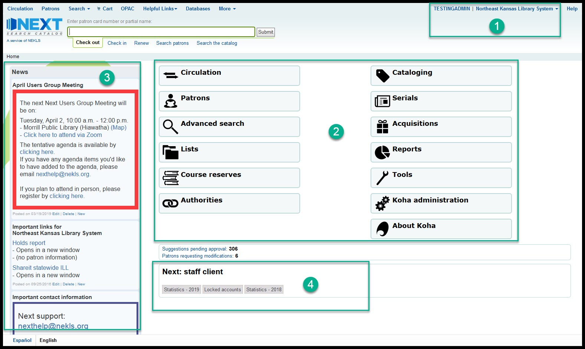

Staff training basics
=====================

###########################
Next Search Catalog history
###########################

Next Search Catalog began as a courier system among Northeast Kansas libraries, and several Northeast Kansas Library System members participated with the Kansas City Public Library Consortia (KCLC) through 2008.  In 2007, NEKLS began to explore alternative options to KCLC, and NEKLS decided in 2008 to manage its own shared catalog called "NExpress."  The Koha integrated library management system was chosen and NEKLS contracted with LibLime - a division of Progressive Technology Federal Systems, Inc. (PTFS).  The Next Koha system went live on August 15, 2008, with 13 participating libraries. In 2011, NEKLS changed support companies from LibLime to ByWater Solutions.  In August of 2018 the catalog was re-branded from NExpress to "Next Search Catalog" and, as of January 2019, includes 44 public libraries; 1 school district; and 1 community college library.

#############
How to log in
#############

Go to the staff client home page and enter your username and password

.. image:: images/010.jpg

###########################
Next staff client home page
###########################

If you log in successfully, you should see the staff client's home page - which should look something like this:

.. image:: images/020.jpg

Things to note:

1. In upper right hand corner of every page you'll see the username you've used to log in and the library that you are logged in at
2. Which modules you see will depend on your security level - the TESTINGADMIN account we've used to log in for training has the highest security level possible
3. Important links and information will appear on the left hand side of the home page
4. Statistics and other important information will appear in the area at the bottom of this page

##############
Basic check-in
##############

###############
Basic check-out
###############

#############################
Creating a new patron account
#############################
