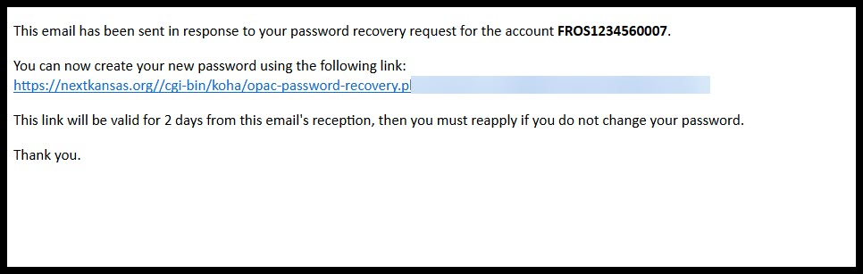
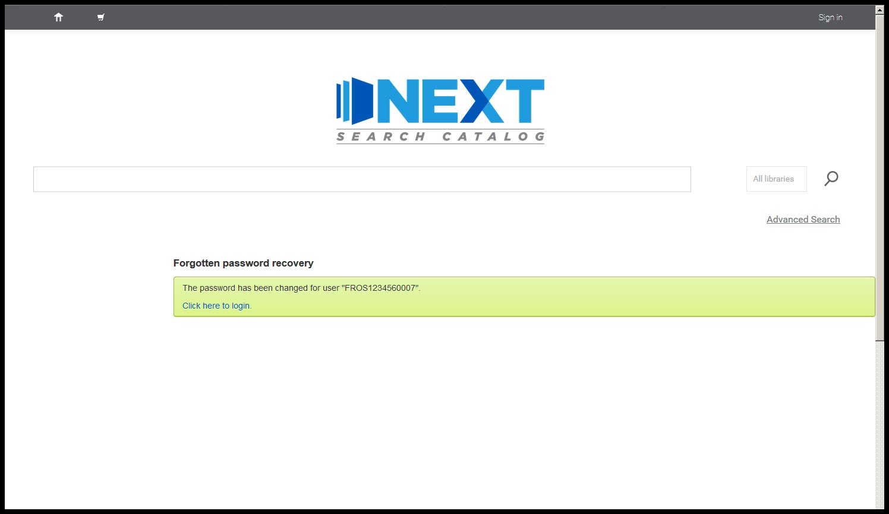

Things you might encounter in circulation
=========================================

Patron account locked due to too many login attempts
----------------------------------------------------

If a patron attempts to log into the OPAC more than 5 times using an incorrect, the system will lock their account.

To the patron, being blocked will look like this:

.. image:: ../../images/330.jpg

To staff, a locked patron will look like this:

Unlocking an account
--------------------

Unlock through the staff client
^^^^^^^^^^^^^^^^^^^^^^^^^^^^^^^

1. When you see the message that a patron's account has been locked, click on the "Change password" button highlighted in green to open the "Change password" page.

.. image:: ../../images/350.jpg

2. Enter the new password for the patron on the "Change password" page.  Please note that you cannot recover an old password.  All you can do is create a new one.

.. image:: ../../images/360.jpg

3. After saving the new password, the message will no longer display on the patron's account.

.. image:: ../../images/370.jpg

Note: You cannot unlock a patron's account through the "Edit" patron function.  It will update the patron's password, but it will not unlock the patron's account.  You *must* use the "Change password" function to unlock the account.

.. image:: ../../images/380.jpg

Unlock through the OPAC
^^^^^^^^^^^^^^^^^^^^^^^

If a patron locks their account *and* there is an e-mail address on their account, they can unlock the account themselves through the "Forgot your password" feature in the OPAC.

1. On the OPAC login page, the patron should click on the "Forgot your password?" link.

2. On the "Forgot your password?" page, the patron needs to fill out the form with A) their card number or username; and B) the e-mail address that goes with this account.

.. image:: ../../images/400.jpg

3. If the login information and the e-mail address match this message should appear:

.. image:: ../../images/410.jpg

4. If successful, the patron should receive an e-mail address like this one within 15 minutes:

5. When the patron opens the link included in the e-mail, they should taken to a page that will allow them to create a new password:

.. image:: ../../images/430.jpg

6. A final message should indicate if the password has been successfully changed.

